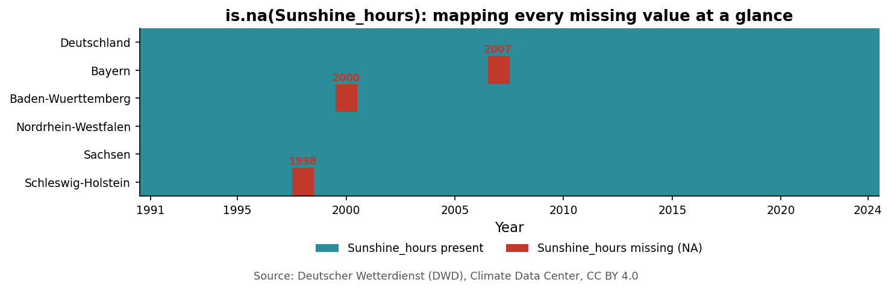

# Understanding and Managing Data {#sec-understanding-data}

::: {.guiding-question}
Guiding question: **What data do I have and how reliable is it?**
:::

::: {.callout-note}
## By the end of this chapter you will be able to:
1. **Classify** any variable you meet as continuous, discrete, nominal or ordinal — and
   explain why that classification decides which summaries and plots are valid.
2. **Check** a downloaded dataset against the tidy-data rules and catch a type error
   before it silently breaks a later calculation.
3. **Diagnose** missing values with `is.na()` — how much is missing, where and what
   that pattern suggests — and pick a defensible strategy for handling them.
4. **Protect** the raw data and turn every cleaning step into a permanent, re-runnable
   script.
:::

*(Source materials: Environmental Statistics with R, DataCamp — see [Resources](resources.qmd). Real-world data: Deutscher Wetterdienst, CC BY 4.0 — see below.)*

## Two Questions Before Any Graph

Every analysis in this course starts the same way, before a single plot or test:
**What data do I have?** and **How reliable is it?**

These are not formalities. Data downloaded from a website has not been checked by
anyone on your behalf. A column may have been mistyped, a value may be missing and a
row may have been duplicated by an overlapping download. If you skip these questions,
every later chapter (graphs, confidence intervals, regression) will produce
confident-looking answers built on unchecked ground.

### The running case

Throughout this chapter you are a student who has downloaded **real climate records**
published by the **Deutscher Wetterdienst (DWD)**, Germany's national weather service —
annual mean temperature, total precipitation and total sunshine duration, for five
German Bundesländer and for Germany as a whole, from 1991 to 2024. The file is called
`dwd_climate_raw.csv` and has six columns: `Region`, `Region_Code`, `Year`,
`Temperature_C`, `Precipitation_mm` and `Sunshine_hours`. Of these three climate
variables, **annual mean temperature is the one this module follows all the way through
to Chapter 4.** This chapter's cleaning exercises, though, work with whichever columns
actually contain the real, disclosed formatting issues: a stray unit suffix in
`Precipitation_mm`, three blanked values in `Sunshine_hours`. Inventing a fake problem in
`Temperature_C` just to keep one column in the spotlight would break this chapter's own
promise that nothing here is invented. Once the file is clean, from Chapter 2 onward,
temperature becomes the one variable you follow all the way through.

::: {.callout-tip collapse="true"}
## About the data in this document
Everything you see in this chapter's numbers is **real, official DWD data** — nothing
is invented. On top of those real values, a small number of formatting issues were
**deliberately added and fully disclosed** (a stray unit suffix, some duplicated rows, a
few blanked-out readings) so this chapter has something concrete to practice finding and
fixing. Every one of these is listed exactly, with exact counts, in
[`data/README.md`](data/README.md) — nothing here pretends a teaching device is a
genuine DWD error. The file is produced by
[`data/generate_climate_dataset.py`](data/generate_climate_dataset.py), which contains
every real value plus the source URLs it was read from, so you can regenerate it (or
verify it against DWD's own files) yourself.
:::

```{mermaid}
%%| fig-width: 6.5
%%| echo: false
flowchart LR
    A["Download<br/>dwd_climate_raw.csv"] --> B["Data<br/>Types"]
    B --> C["Data quality:<br/>tidy, type, range"]
    C --> D["Missing<br/>Values"]
    D --> E["Data<br/>Management"]
    E --> F["Clean file,<br/>ready for Ch. 2"]
    style A fill:#2c8c99,color:#fff
    style F fill:#d98c2b,color:#fff
```

## Data Types

Every column in a dataset has a **type** and the type decides which summaries and plots
are even mathematically valid. There are two families, each with two members.

**Numerical variables**

- **Continuous.** Think of time on a stopwatch. It doesn't jump — it moves smoothly
  through decimals and you can always split it into smaller and smaller fractions. A
  continuous variable can take a wide range of numeric values where it is sensible to
  add, subtract, or average and it varies without fixed gaps. `Temperature_C`,
  `Precipitation_mm` and `Sunshine_hours` are all continuous — a temperature of 9.37°C
  is a perfectly meaningful value.
- **Discrete.** Now think of eggs in a carton. You count them in whole numbers; you
  cannot buy 2.5 eggs. A discrete variable can only take numeric values with jumps —
  typically non-negative counts. `Year` behaves this way here: it only takes whole
  values.

**Categorical variables**

- **Nominal.** Think of a box of crayons. A green crayon isn't "higher" or "better" than
  a yellow one — they are simply different, unordered categories. A nominal variable's
  possible values are called **levels** and those levels have no natural mathematical
  hierarchy. `Region` is nominal: `"Bayern"` is not more or less than `"Sachsen"`, they
  are simply different places.
- **Ordinal.** Think of coffee cup sizes. They are distinct categories, not continuous
  numbers — but you universally know that a medium is larger than a small and smaller
  than a large. An ordinal variable is fundamentally categorical, but its levels have a
  natural order. None of our columns are ordinal here, but you will meet this type in
  your own challenge dataset (for example, an air-quality index reported as
  "good / moderate / poor").

::: {.acemate-box}
If you're unsure whether a column is discrete or continuous, ask your learning buddy for
three real-world examples of each — but check its answer against the "can you meaningfully
have half of one?" test yourself, rather than taking the label on trust.
:::

::: {.callout-note}
## A note on units
Strictly speaking, the SI base unit for temperature is the kelvin — but climate science
(and DWD's own data) reports temperature in **degrees Celsius (°C)**, precipitation in
**millimetres (mm)** and sunshine duration in **hours (h)**, because these are the
practical, universally understood units for this domain and changing them would make
the numbers harder to sanity-check, not easier. Every chart, table and figure in this
module states its unit explicitly and consistently — get in the habit of checking the
unit on every axis and every number before you trust it, here and in your own challenge
dataset.
:::

## Understanding Datasets and Data Quality

As a student, you downloaded real climate data from a website. This is our base case. To
move ahead and produce a trustworthy analysis, you first need to check the file against
the **tidy data** rules and then check the values inside it.

**The tidy data rules:**

- **Columns must be variables.** Each column tracks exactly one thing (`Temperature_C`,
  `Precipitation_mm`, never both mixed into one).
- **Rows must be observations.** Each row is a single, distinct data-collection event —
  here, one region in one year.
- **Cells must hold single values.** A cell can never combine two things, such as
  writing `"9.4C / 60mm"` in one field. Each measurement gets its own cell.

*Analogy:* think of an ice-cube tray. Rows are the tray's horizontal bars, columns are
its vertical lines of pockets and each individual pocket is a cell meant to hold exactly
one splash of water. If whoever built the file merged pockets together or poured data
across the dividers, the structure breaks and no analysis tool can "freeze" it into
something usable.

```r
library(tidyverse)
climate <- read_csv("data/raw/dwd_climate_raw.csv")
dim(climate)
glimpse(climate)
```

<details><summary>Code walkthrough</summary>
- `dim(climate)` — rows × columns.
- `glimpse(climate)` — one line per column, with its type and a few example values.
</details>

Our file already has this shape — one row per region-year combination, one column per
variable — which is exactly what lets you `filter()`, `group_by()` and plot it directly
once the values inside it are clean.

### Checking types

After opening a downloaded file in R, the very first thing to check is whether every
column has the type it claims to have.

```r
str(climate)
class(climate$Precipitation_mm)
```

`Precipitation_mm` should be numeric throughout — but `str()` shows it as `character`.
Somewhere in the file, at least one value contains something other than digits and a
decimal point and R is protecting you from silently losing information: a column can
only have one type, so if even one cell contains non-numeric text, the *entire* column
is read as text.

```r
climate %>%
  filter(is.na(suppressWarnings(as.numeric(Precipitation_mm)))) %>%
  select(Region, Year, Precipitation_mm)
```

This turns up **5** entries of the form `"885.0mm"` — a real number with a stray unit
suffix typed in. `parse_number()` (or `readr`'s own numeric parsing) strips the unit and
recovers the real value.

*Analogy:* think of an automated conveyor-belt scanner at checkout. Instead of manually
weighing every item, the scanner reads each barcode and checks it against what that
product should weigh. `class()` is the same idea applied to a column: it checks whether
what came down the belt actually matches the type it was supposed to be.

### Checking ranges

Once every column has the right type, check whether every value is physically plausible
for what it claims to measure.

```r
climate %>%
  summarise(
    temp_min = min(Temperature_C, na.rm = TRUE), temp_max = max(Temperature_C, na.rm = TRUE),
    precip_min = min(as.numeric(gsub("mm", "", Precipitation_mm)), na.rm = TRUE),
    sun_min = min(Sunshine_hours, na.rm = TRUE), sun_max = max(Sunshine_hours, na.rm = TRUE)
  )
```

Annual mean temperatures across these five regions fall between about 6.7°C and 11.5°C —
entirely plausible for Germany. Precipitation and sunshine values are likewise within the
range you'd expect for a temperate European climate. **This check passes.** That is not a
wasted step: you only know that because you looked, not because nothing seemed obviously
wrong. Continuing the conveyor-belt picture: range checks are the belt's alarm light. If
a box came through weighing 500kg instead of 5kg, the light would trip — here, it stays
off.

### One more thing worth checking: duplicates

```r
climate %>% count(Region, Year) %>% filter(n > 1)
```

This turns up **4** region-year combinations appearing twice — for example,
`Baden-Württemberg`, 1994. This isn't a measurement error; it's what happens when two
overlapping export files get concatenated without checking. `distinct()` removes the
repeats.

::: {.callout-tip collapse="true"}
## A real detail worth knowing: where the numbers actually came from
DWD's full historical files (1881–present) list columns like `Niedersachsen` *and*
`Niedersachsen/Hamburg/Bremen` side by side, because Hamburg and Bremen were reported
jointly with Niedersachsen in earlier decades before being split out. That's not a
quality problem to fix — it's exactly the kind of thing you can only know by reading a
provider's own documentation, not by guessing from a column name. The five regions used
in this chapter were chosen specifically because each was reported as one stable region
for the entire 1991–2024 period. Source: [DWD Climate Data
Center](https://opendata.dwd.de/climate_environment/CDC/regional_averages_DE/annual/),
CC BY 4.0, retrieved 24 September 2026.
:::

## Missing Values

Even a mostly-clean file can have gaps. R treats missing data as a strict structural
state: it forces missing observations into a vector as `NA` ("Not Available") and if a
column contains even one `NA`, running a basic math function like `mean()` on it
automatically returns `NA` too. This is a safety feature — it stops you from silently
ignoring a gap — not a bug.

```r
climate %>%
  summarise(across(everything(), ~ sum(is.na(.))))
```

`Sunshine_hours` has **3** missing values out of 208 raw rows — scattered across
different regions and years, with no single region or year responsible for all of them.
Rather than visually hunting for blank cells, `is.na()` lets you map every missing entry
across the whole file at once:

{fig-alt="Heatmap of Region by Year showing three isolated missing Sunshine_hours values: Schleswig-Holstein 1998, Baden-Württemberg 2000 and Bayern 2007."}

*Analogy:* think of a broken link in a bicycle chain. If one link is missing, trying to
pedal moves nothing — the chain simply won't turn. That's `NA` doing its job: an
intentional stop sign, not something to route around silently. Appending `na.rm = TRUE`
to a function is like removing the broken link and snapping the remaining good pieces
back together so you can move forward again — deliberately, not by accident.

But *how* you go around a gap depends on what you're trying to calculate. Three
strategies, in order of how much they assume:

**Strategy A — Column-specific omission.** When analysing temperature trends, use the
whole row as normal. When analysing sunshine specifically, tell R to skip just the
missing entries with `na.rm = TRUE` (e.g. `mean(climate$Sunshine_hours, na.rm = TRUE)`).
Every other column in that row stays fully usable.

**Strategy B — Linear interpolation.** Because this file is recorded once per year, you
can estimate a single missing year's value as the average of the year before and the
year after, *for that same region*. Schleswig-Holstein's missing 1998 sunshine value, for
instance, could reasonably be estimated from its 1997 and 1999 values. This only makes
sense when the gap is a single isolated point in an otherwise regular series — not when
several consecutive years are missing.

**Strategy C — Complete-case analysis (listwise deletion).** If your goal is specifically
a multi-variable calculation that needs all three climate variables at the exact same
region-year — for example, the regression in [Chapter
4](04-statistical-modelling.qmd) — remove that row entirely with `na.omit()` or
`drop_na()`. You lose the row's other variables too, but you avoid quietly mixing real
and estimated values into one model.

::: {.exercise-box}
### Exercise 1.1 — Decide, don't just delete

<!-- Checks: match a missing-value strategy to what you are actually about to calculate, instead of applying one default rule everywhere. -->

**Q1.** With only 3 missing values, scattered rather than concentrated, which strategy
(A, B or C) would you choose for a 34-year trend line of `Sunshine_hours` alone? Which
would you choose if you were about to fit the multiple regression from
[Chapter 4](04-statistical-modelling.qmd), which uses `Sunshine_hours`, `Year` *and*
`Region` together? Justify the difference.

**Q2.** Now imagine instead that all 3 missing values belonged to the same region in the
same decade. Would your answer change? Why?
:::

## Data Management {#data-management}

Web data can change, update, or disappear from a site tomorrow. Two habits protect every
analysis you build on top of today's download:

1. **Never overwrite the raw file.** Save `dwd_climate_raw.csv` into a dedicated,
   locked-down folder and never modify it by hand — not even to fix the one thing you
   already know is wrong. Every cleaning step (stripping the `"mm"` suffix,
   `distinct()`-ing the duplicates, deciding how to handle the 3 missing values) happens
   in code that reads the raw file and writes a *separate* clean one.
2. **Make cleaning reproducible.** Typing a fix directly into the R console vanishes the
   moment you close the session. Write every adjustment into a permanent,
   re-runnable script file, so that any researcher — including you, in six months — can
   click "Run" and recreate exactly the same clean dataset from a fresh copy of the raw
   download.

::: {.acemate-box}
If you ask your learning buddy to "clean my data," ask it to show you the code rather
than hand you an already-cleaned file — you want to be able to re-run the same steps
yourself on a future download and to catch it if it silently drops a row you didn't ask
it to.
:::

::: {.differentiation-box}
::: {.struggling}
If `class()`, `str()` and the idea of a column "type" still feel unfamiliar:
[swirl](https://swirlstats.com/students.html)'s "R Programming" module runs short,
interactive exercises on exactly this, directly in your own R console.
:::
::: {.deeper}
If the tidy-data rules clicked and you want the full reasoning behind them, straight
from the source: Hadley Wickham's ["Tidy
Data"](https://www.jstatsoft.org/article/view/v059i10) (Journal of Statistical Software,
2014) is the short, readable paper that defined the rules you just used.
:::
:::

::: {.sources-box}
[Deutscher Wetterdienst — Climate Data Center](https://opendata.dwd.de/climate_environment/CDC/) ·
[DWD Terms of use (CC BY 4.0)](https://opendata.dwd.de/climate_environment/CDC/Terms_of_use.pdf) ·
[Hands-On Programming with R](https://rstudio-education.github.io/hopr/) ·
[R for Data Science](https://r4ds.hadley.nz/).
Full list with descriptions: [Resources](resources.qmd#understanding-and-managing-data).
:::

## Chapter Summary

You now have a repeatable process: classify every variable by type, check a downloaded
file against the tidy-data rules, check that every column's type and range are what they
claim to be, map and diagnose missing values with `is.na()` and protect the raw
download behind a reproducible script — so that everything you build in Chapters 2–4
rests on ground you've actually checked, not just glanced at.

## Common Mistakes

| Mistake | Why it matters | Fix |
|---|---|---|
| Assuming a column is numeric because it "looks like numbers" | One stray text value (a unit suffix, a typo) forces the whole column to `character` | Always run `class()` / `str()` before summarising |
| Deleting every row with any `NA` by default | Throws away real, usable data in every *other* column of that row | Match the strategy (A/B/C) to what you're actually calculating |
| Editing the raw CSV by hand | Not reproducible — the next download won't get the same fix | Clean via a script that reads raw and writes clean |
| Treating "nothing looked wrong" as "I didn't need to check" | A passing check is still a checked, reportable fact | Run the type and range checks every time, even when the data looks fine |

## Check Your Understanding

- Could you explain, to someone who has never seen this dataset, the difference between
  a discrete and a continuous variable using two of its actual columns?
- Why does one stray unit suffix like `"885.0mm"` force an entire numeric column to be
  read as text?
- Given 3 scattered missing values, could you explain when Strategy A, B or C is the
  right choice — and when it isn't?

## Practice Exercises

<!-- Internal note for whoever maintains this module: each item below has an HTML
comment right before it stating what it checks, e.g. this one is for Fabian/the intern
team, not for students — it doesn't render on the published page. Item 7 is adapted
from Christina Bogner's environmental_stat, Appendix C "Additional exercises"
(chrisbogner.github.io/environmental_stat, CC BY-NC-SA 4.0), one of the few genuinely
self-contained conceptual questions in that material that doesn't require its own
dataset — most of Bogner's other exercises are tied to a specific dataset (penguins,
nycflights, etc.) and don't lift out cleanly as standalone revision questions. -->

*A short set of standalone revision questions, each with a model answer to check
yourself against.*

::: {.exercise-box}
<!-- Checks: can you assign the right variable type from a real column name alone, including one you haven't seen before? -->
**1. Classify.** For each of the following, state the
variable type: `Region`, `Year`,
`Temperature_C`, a hypothetical "heatwave severity: mild/moderate/severe" column.

<details><summary>Answer</summary>
`Region` — categorical (nominal). `Year` — discrete numeric. `Temperature_C` —
continuous numeric. The hypothetical severity column — categorical (ordinal): it has a
natural order, unlike `Region`.
</details>

<!-- Checks: can you explain, without running any code, why one bad cell breaks a whole column's type? -->
**2. Find the type error.** Look at `"885.0mm"`. Why does even one value
like this force the whole `Precipitation_mm` column to be read as `character` instead of
`numeric`?

<details><summary>Answer</summary>
A column can only have one type in R. If even one cell contains non-numeric characters,
R (or `read_csv()`) reads the entire column as text/character to avoid silently
discarding the one bad cell.
</details>

<!-- Checks: can you predict the correct row count of a cleaned file from its stated coverage and use that as a sanity check on your own work? -->
**3. Coverage arithmetic.** Five
regions, 34 years each, plus one national series of 34 years and 4 duplicated rows in
the raw download. How many rows should the *clean* file have after removing the
duplicates? Show your work.

<details><summary>Answer</summary>
$5 \times 34 = 170$ region-year rows, plus $34$ national rows, for $170 + 34 = 204$
total after `distinct()` removes the 4 duplicates from the 208-row raw file.
</details>

<!-- Checks: can you tell a real repeated measurement apart from a true duplicate row, using the same column values? -->
**4. Duplicates vs. legitimate repeats.**
`Region == "Bayern"` naturally appears 34 times (once per year) in a tidy file. How is
that different from the kind of duplicate you found in the "Understanding Datasets and
Data Quality" section above?

<details><summary>Answer</summary>
34 rows for Bayern across 34 *different* years are 34 distinct observations — that's
expected. A true duplicate is the *same* Region-Year combination appearing more than
once, which should be a single observation.
</details>

<!-- Checks: can you pick the right missing-value strategy (A, B or C) for a specific calculation and explain why the other two would fit worse? -->
**5. Strategy choice.** You need
the exact multi-variable correlation between
`Temperature_C`, `Precipitation_mm` and `Sunshine_hours` at the same region-year. One of
those three values is missing for one row. Which strategy (A, B or C) fits and why would
the other two be a worse fit here specifically?

<details><summary>Answer</summary>
Strategy C (complete-case analysis / `na.omit()`): a joint multi-variable calculation
needs all three real values at the same row, so estimating the missing one (B) would mix
real and invented data into the correlation and column-specific omission (A) doesn't
apply once you need all three columns together.
</details>

<!-- Checks: do you know what an open licence actually requires of you in practice, not just its name? -->
**6. License and attribution.** What does "CC BY 4.0" require you to do
if you publish a chart built from this data?

<details><summary>Answer</summary>
Attribute the source — e.g. "Source: Deutscher Wetterdienst (DWD), Climate Data Center,
CC BY 4.0" — but you are otherwise free to use, adapt and republish it, including
commercially.
</details>

<!-- Checks: do you understand NA propagation well enough to fix a broken summary
statistic, not just avoid it by habit? Adapted from Christina Bogner, environmental_stat,
Appendix C.1.2 "Missing values" (CC BY-NC-SA 4.0). -->
**7. NA propagation.** Suppose `Sunshine_hours` for one region's 34 years is stored as a
plain vector and you run `sum(Sunshine_hours)`. One value in that vector is `NA`. What
does `sum()` return and why? How would you correct the call so it returns the total of
the non-missing values instead?

<details><summary>Answer</summary>
`sum()` returns `NA`: R treats "unknown plus anything" as itself unknown, so a single
missing value poisons the whole sum rather than being silently skipped. Fix it with
`sum(Sunshine_hours, na.rm = TRUE)`, which tells R explicitly to remove the `NA` values
before summing — the same `na.rm = TRUE` pattern from Strategy A earlier in this
chapter.
</details>
:::

Continue to [Chapter 2, Exploring and Visualising Data](02-exploring-visualizing.qmd).
